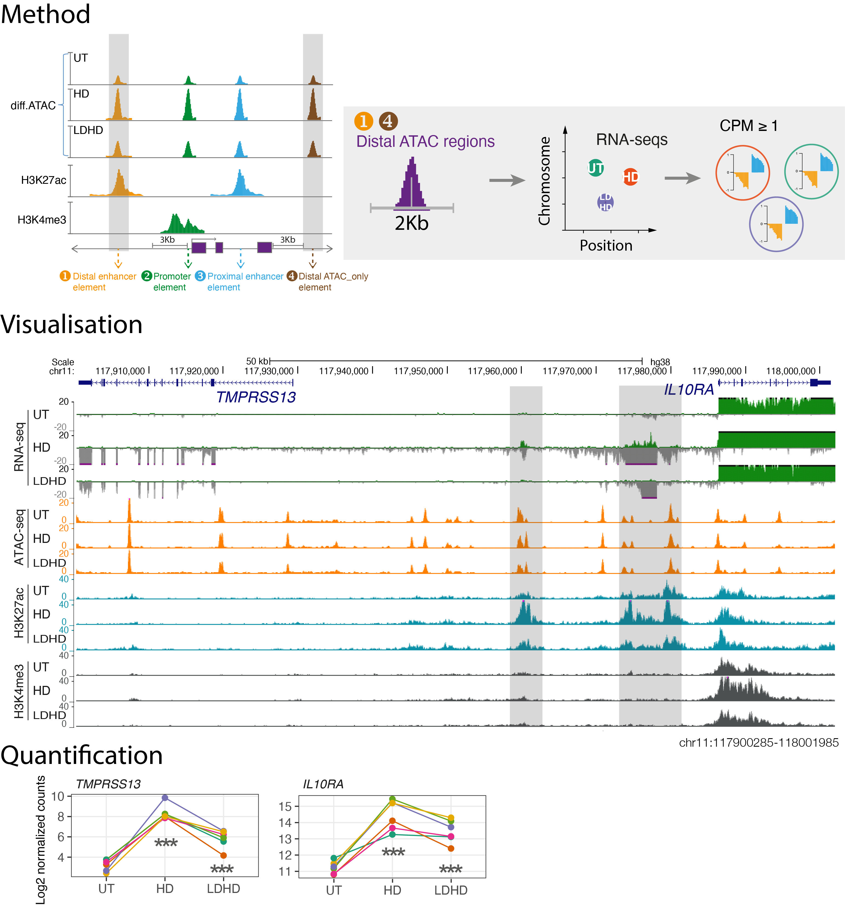
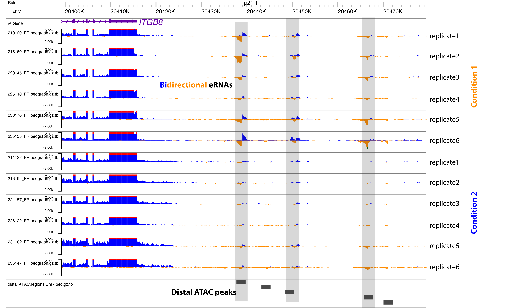

# Enhancer RNA

This repository contains code to visualise and quantify the enhancer RNAs (eRNAs) transcribed from active enhancers. 

## Overview

eRNA analysis was performed on ±1000 bp regions centered on the `distal ATAC-seq peaks`. First, the midpoint of each ATAC peak was extended with 1000 bp from left and right. Second, the regions that overlap with the gene boundaries (±3000 bp from both transcription start site and end site) of the expressed genes (maximum TPM  ≥1 across samples) were filtered out. Third, the remaining ATAC peaks (distal) were used as coordinates to count the number of uniquely-mapped total RNA-seq reads in each condition via the multicov function of bedtools. Those regions with RNA expression level of CPM (counts per million mapped reads) ≥1 were defined as eRNAs.The raw read counts for each eRNA across treatment conditions were used as input into DESeq2 for pair-wise comparisons. 
 
The strandedness of the `directional total RNA-seq reads` was extracted using Samtools and deepTools, and the normalised bidirectional bedgrapgh files were generated using Bedtools and Bedops, and visualised through UCSC or WashU Epigenome Browser.

This code has been tested on a Univa Grid Engine (UGE) batch-queuing system. Please set up a conda environment for running on a desktop computer, install the packages listed in the `requirements.txt` file.

## Example commands:

```
sh ./data.sh

```
## 

Alternatively, run the following script to quantify eRNA via featureCounts.

```
awk 'OFS="\t" {print $1":"$2"-"$3, $1, $2, $3, "."}' test.data/distal.ATAC.regions.Chr7.txt > peak.saf

/apps/htseq/subread-1.6.4-Linux-x86_64/bin/featureCounts -T 12 \
-p \
-F SAF \
-a peak.saf \
-o eRNA_featureCounts.txt \
Mapping/mapped.hisat2/*_chr.uniq.mapped.bam

```

## Schematic and example result:

#### see details about this result [here](https://genomebiology.biomedcentral.com/articles/10.1186/s13059-022-02702-1) - Zhang, P. *et al*. Epigenomic analysis reveals a dynamic and context-specific macrophage enhancer landscape associated with innate immune activation and tolerance. *Genome Biology* 23, 1-21 (2022).

## Example result based on the test data:


## Contact
For questions about this repository, requests for additional data, or further details about the results, please contact: pzhang@well.ox.ac.uk.
